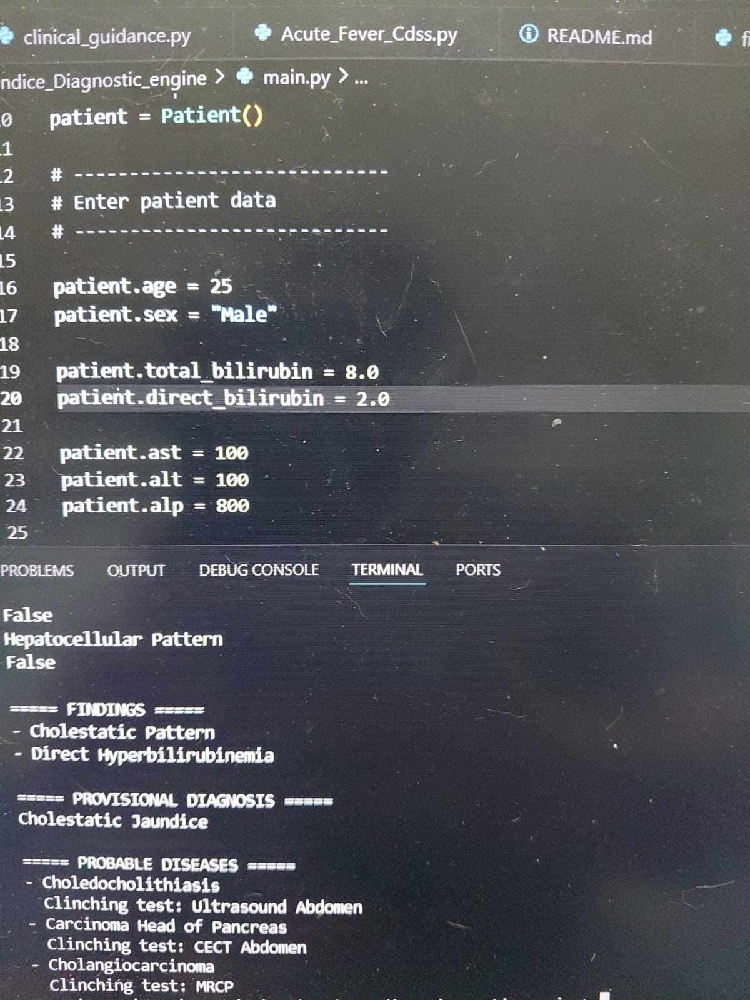

# Jaundice Diagnostic Engine

A Python-based **Clinical Decision Support System (CDSS)** designed to assist healthcare professionals in the systematic evaluation of patients presenting with jaundice.

The engine applies a structured, rule-based diagnostic approach using patient history, physical examination findings, laboratory investigations, and accepted clinical reasoning to classify jaundice, generate differential diagnoses, and recommend appropriate next diagnostic steps.

> **This software is intended as a clinical decision-support and educational tool. It does not replace physician judgment.**

## Screenshot

---

## Features

- Structured rule-based diagnostic algorithm
- Classification of unconjugated and conjugated hyperbilirubinemia
- Differential diagnosis generation
- Investigation recommendations based on clinical findings
- Pattern recognition using biochemical parameters
- Simple command-line interface
- Easily expandable architecture for future disease modules

---

## Current Diagnostic Coverage

- Unconjugated Hyperbilirubinemia
- Conjugated Hyperbilirubinemia
- Hepatocellular injury
- Cholestatic injury
- Mixed liver injury
- Hemolytic jaundice
- Extrahepatic biliary obstruction
- Drug-induced liver injury (DILI)
- Suggested investigations for common diagnostic pathways

---

## Technologies Used

- Python 3
- Rule-based Expert System
- Command-Line Interface (CLI)

---

## Future Development

Planned improvements include:

- Graphical User Interface (GUI)
- Web application
- Machine Learning integration
- Evidence-based clinical scoring systems
- Automated interpretation of laboratory data
- Integration with additional Clinical Decision Support Systems (CDSS)
- Electronic Health Record (EHR) compatibility
- Continuous evidence-based updates

---

## Limitations

- This Clinical Decision Support System is intended to assist clinicians and should not replace clinical judgment.
- Diagnostic recommendations should always be interpreted together with patient history, physical examination, laboratory investigations, imaging studies, and institutional guidelines.
- The algorithm is based on commonly accepted clinical principles and may not account for uncommon or atypical presentations.
- **The R-value is primarily validated for the assessment of suspected Drug-Induced Liver Injury (DILI). Its application to patients with non-DILI causes of jaundice has limited validation and should therefore be interpreted with caution.**

---

## Disclaimer

This project is intended for educational, research, and clinical decision-support purposes only.

The author makes no claim that this software should be used as the sole basis for diagnosis or patient management. Final clinical decisions remain the responsibility of the treating physician.

---

## Author

**Dr. Dhananjay Tiwari**  
MD (Biochemistry)

---

## License

This project is released under the MIT License.